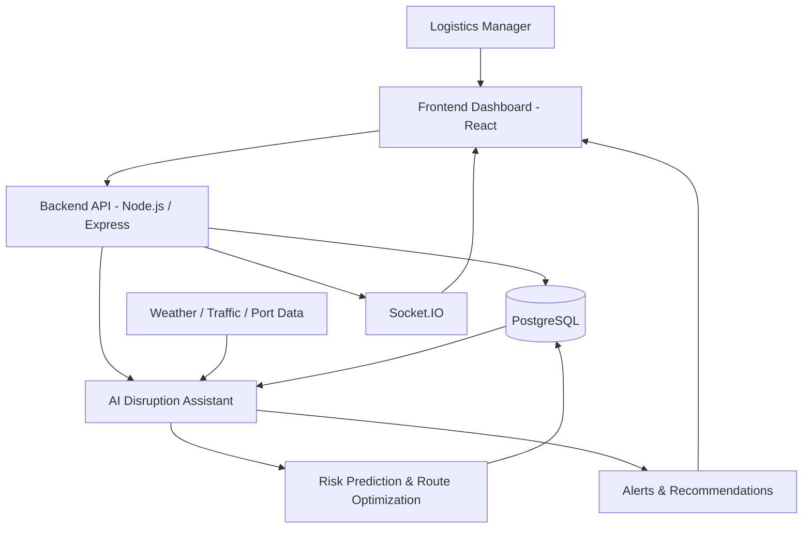

# Solution Overview

## What We Built

We built an AI-powered supply chain transportation platform that helps logistics managers monitor shipments and respond to transportation disruptions before they become major problems.

The platform brings important transportation information into one dashboard, including shipment status, routes, delivery schedules, and disruption-related information such as weather, traffic, and port conditions.

Instead of requiring logistics managers to manually check different sources and decide what to do, the system analyzes the available information and highlights shipments or routes that may be at risk. It can identify potential delays, provide risk insights, suggest alternative actions or routes, and generate alerts when an important disruption is detected.

The dashboard also provides real-time updates so that logistics teams can quickly understand what is happening and take appropriate action.

In simple terms, our solution helps logistics teams **see transportation risks earlier, understand their potential impact, and make faster decisions to keep shipments moving.**

## How It Works

1. **Transportation data is entered or collected** — The logistics manager provides shipment details such as source, destination, delivery schedule, vehicle information, and route details.
2. **The system collects disruption information** — Relevant external information such as weather, traffic, and port conditions is combined with the transportation data.
3. **The data is analyzed** — The AI Disruption Assistant analyzes the shipment and disruption information to identify potential transportation risks and delays.
4. **Risk and route recommendations are generated** — The system predicts possible disruptions and provides recommendations, such as changing a route, adjusting a delivery schedule, or taking preventive action.
5. **Results are stored and displayed** — Risk scores, shipment information, and recommendations are stored in the database and displayed on the logistics dashboard.
6. **Real-time alerts are provided** — When a significant disruption or high-risk situation is detected, the system sends an alert to the dashboard so the logistics manager can respond quickly.

## Architecture Diagram

> See [`architecture.md`](architecture.md) for the detailed architecture and system flow.

The following diagram provides a quick overview of how the main components interact:

## Key Design Decisions

| Decision                                                                    | Rationale                                                                                                                                                    |
| --------------------------------------------------------------------------- | ------------------------------------------------------------------------------------------------------------------------------------------------------------ |
| Used IBM watsonx.ai for disruption analysis and AI-assisted recommendations | Provides AI capabilities for analyzing transportation risks and generating actionable insights without requiring a custom AI model to be built from scratch. |
| Used Node.js / Express for the backend API                                  | Provides a lightweight and flexible backend for handling transportation data, business logic, external services, and AI integration.                         |
| Used PostgreSQL for transportation data storage                             | Provides reliable structured storage for shipments, routes, vehicles, delivery information, disruption events, and prediction results.                       |
| Used Socket.IO for real-time updates                                        | Allows shipment status, risk information, and alerts to be pushed to the dashboard without requiring users to continuously refresh the page.                 |
| Combined internal transportation data with external disruption signals      | A disruption can depend on factors such as weather, traffic, and port conditions, so combining multiple sources provides better context for risk analysis.   |
| Used a centralized dashboard for logistics managers                         | Gives users a single place to monitor shipments, identify risks, view recommendations, and respond to disruptions quickly.                                   |
| Used IBM Bob during development                                             | Accelerated application development and helped with implementation, code generation, and development workflow during the hackathon.                          |

*## IBM Technologies Used

### IBM Bob

IBM Bob was used as an AI-assisted development tool during the implementation of the project. It helped accelerate the development of the supply chain transportation platform by assisting with application structure, frontend and backend implementation, code generation, debugging, and refinement of features.

### IBM watsonx.ai

IBM watsonx.ai is used as the AI layer of the solution. Transportation and disruption-related information is provided to the AI system to analyze potential risks such as shipment delays, route disruptions, and changing transportation conditions. The AI assistant then generates risk insights and actionable recommendations that are presented to the logistics manager through the dashboard.

### IBM Cloud

IBM Cloud can be used to host and deploy the application and its required services in a scalable cloud environment. It provides the infrastructure needed to make the transportation solution accessible beyond the local development environment.

- **[IBM Tech 1, e.g., watsonx.ai]:** [How it was used — e.g., "Used the `ibm/granite-13b-instruct-v2` model via the Python SDK to classify anomaly types from log text."]
- **[IBM Tech 2]:** [How it was used]
